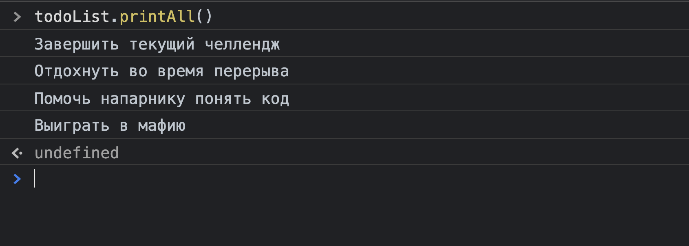

# Task: разработать консольный список дел

## Постановка задачи

Разработать приложение списка дел, которым можно управлять через консоль разработчика.

Среди возможностей приложения должно быть:

- вывод всех дел в консоль;
- добавление новых дел в список;
- удаление дел;
- отметка дел как выполненных.

Каждая отдельная [фича](https://chto-eto-takoe.ru/feature) будет разработана в отдельной подзадаче.

Подготовь почву, чтобы начать работать.

- Создай файлы HTML и JavaScript. Свяжи их тегом `<script>`.
- Скопируй в js-файл следующий объект:

```javascript
const todoList = {
  items: [
    {
      text: 'Завершить текущий челлендж',
      completed: false,
    },
    {
      text: 'Отдохнуть во время перерыва',
      completed: false,
    },
    {
      text: 'Помочь напарнику понять код',
      completed: false,
    },
    {
      text: 'Выиграть в мафию',
      completed: true,
    },
  ],

  printAll: function() {},

  add: function(text) {},

  remove: function(index) {},

  print: function(index) {},

  complete: function(index) {},
};
```

Свойство `items` содержит в себе элементы списка дел.

Каждый элемент представлен в виде JavaScript-объекта. Свойство `completed` отражает информацию о том завершено данное дело (`true`) или еще нет (`false`).

## Subtask 1. Вывод всех элементов

Реализуй метод `printAll()`, который будет выводить текст каждого элемента в консоль.

Для реализации тебе понадобится цикл `for`.

В результате должно получиться примерно так:



## Subtask 2. Добавление новых элементов

Напиши метод `add()`, который будет принимать текст ногого дела в виде параметра и добавлять его **в начало** массива `items`.

Имей в виду, что `items` – это специальная структура данных: массив с объектами одинаковой формы (то есть у каждого объекта в этом массиве одинаковые свойства). Добавляя новый элемент в этот массив ты не должен нарушать эту структуру.

Значение свойства `completed` для добавляемых элементов должно быть равным `false`.

Метод должен работать следующим образом:


## Subtask 3. Удаление элементов

Зачем держать завершенные дела в нашем списке вечно? Давай напишем метод, который позволял бы удалять определенные элементы из списка по их индексу.

Назови метод `remove()`. Он будет принимать на вход один числовой параметр – индекс удаляемого элемента.

Для удаления элемента из массива по его индексу тебе понадобится метод массивов `.splice()`.

После закрытия данной подзадачи у пользователя нашего приложения будет возможность

- смотреть список дел
- добавлять новые дела
- удалять дела по индексу


## Subtask 4. Вывод одного элемента

Метод `printAll()` реализованный ранее выводит весь список дел. Это удобно, но часто бывает ситуация, когда нужно просмотреть только один из элементов.

Напиши метод `print()`. Он должен

- принимать один параметр – это будет индекс элемента.
- выводить в консоль текст этого элемента.


Обрати внимание – выводится не весь объект, а только его свойство `text`.

## Subtask 5. Завершенные дела

С самого начала объект дела содержит ключ `completed`, который мы никак не используем. Пришло время исправить это.

Доработай функцию `print` так, чтобы перед текстом дела он выводил пиктограмму `[ ]` если дело не завершено, либо `[х]` в ином случае.


## Subtask 6. Список дел + пометки

Наше приложение хорошо расширилось.

Метод `printAll()`, созданный в самом начале теперь устарел: он выводит элементы без пометок об их завершенности. 

Метод `print()` умнее: он выводит не только текст, но и информацию о завершенности дела в виде пиктограмм `[ ]` или `[x]`.

Мы можем улучшить метод `printAll()` за счет метода `print()`. Для этого внутри `printAll()` при каждом обходе цикла нужно вызывать метод `print()` и передавать в него индекс текущего элемента. Таким образом мы делегируем часть задачи на другой метод, чтобы не повторять его код.

В итоге код метода `printAll()` будет примерно со следующей структурой:

```javascript
const todoList = {
  printAll: function () {
    for(i равно 0; i меньше длины items; увеличить i) {
      вызвать print и передать в него i
    }
  }
}
```

А работать это будет так:


## Subtask 7. Возможность завершения дел

Нужно дать пользователю самому выбирать какие дела являются завершенными.

Для этого доработай метод `complete()`, который принимает в качестве параметра индекс. Элемент с указанным индексом должен помечаться завершенным. То есть значение свойства `completed` этого объекта должно поменяться на `true`.


## Закрываем задачу

Проведи код-ревью и постарайся исправить недочеты в коде, если найдешь их. Отформатируй код, чтобы правильно расставить пробелы и переносы.

Изучи внимательно код. Подметь все моменты, которые оказались для тебя новыми. Скорее всего ты не увидишь ничего принципиально нового. Ты использовал конструкции, которые и так были тебе известны ранее. Однако, ты начал сочетать их по новому.

На самом деле ты уже знаешь очень много, но чтобы понять это нужно набраться еще больше практического опыта: написать как можно больше строчек кода и столкнуться с как можно большим количеством ошибок. Этим мы займемся в последующих тасках.

Создай новый репозиторий и выгрузи свою работу.
